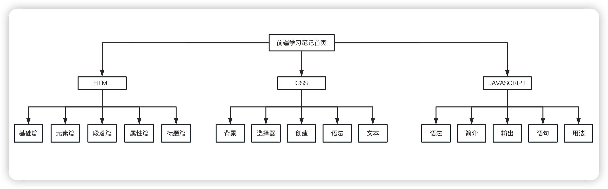
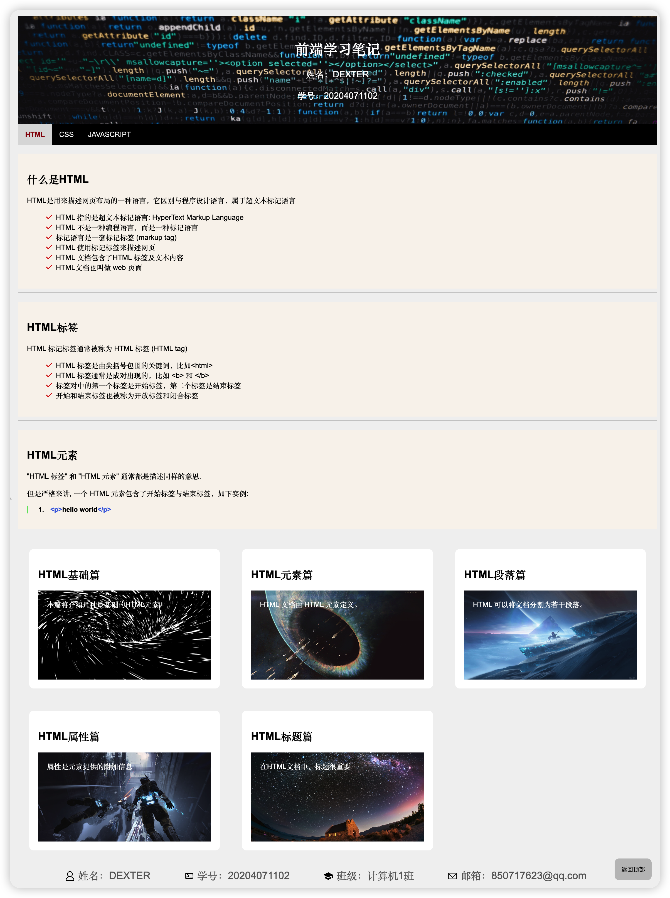

# 前端课程设计

- 项目名称：前端学习笔记网站
- 开发工具：WebStorm
- 开发语言：HTML、CSS、JavaScript
- 开发时间：2022.11.1-2021.11.6
- 项目架构：

### 要求
1. 动手制作网页之前，必须认真做好网站的需求分析，策划好网站的主题，规划好网站的风格和结构，创建完善的目录结构。
2. 主题要求积极健康，原创，除文章、图片可以从网络进行收集以外，其它的内容要求原创。
3. 布局合理，导航要清晰，不能出现错误链接。
4. 适当的使用CSS和JavaScript等进行网站的美化。
5. 要求根据网站的主题，设计栏目。网站中的网页包含10个页面以上。

### 效果图
